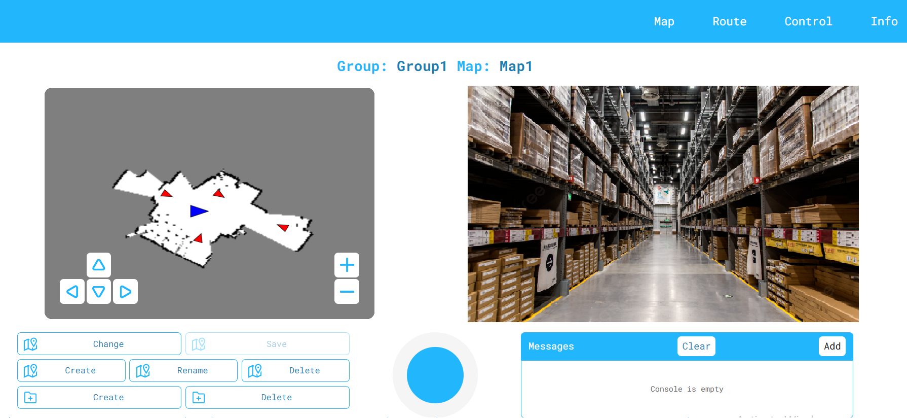

**User interface**
----------------------------

**OpenAMR\_UI** is an open-source software package designed for the Robot Operating System (ROS) Noetic distribution. It provides a user-friendly interface for the comprehensive control and management of autonomous mobile robots (AMRs) built on platforms like Linorobot or similar systems.

**Key functionalities:**

**Map creation and editing:** OpenAMR\_UI facilitates the creation of detailed digital maps representing the operational environment of the AMR. These maps encompass information on walls, obstacles, and other relevant features. The software allows for:

*   Constructing new maps from scratch
    
*   Organizing multiple maps into logical groups for efficient management
    
*   Changing current maps for managing navigation through different floors etc
    

**Route planning and management:** OpenAMR\_UI empowers users to define specific routes for the AMR to navigate within the created maps. These routes essentially function as pre-programmed instructions, dictating the AMR's movement and obstacle avoidance strategies. The software allows:

*   The creation of multiple routes within a single map, catering to various tasks or objectives
    
*   Setting a specific task at each waypoint to execute it (in dev)
    

**Robot control and monitoring:** With maps and routes established, OpenAMR\_UI offers comprehensive control over the AMR's operation. Users can:

*   Initiate and terminate robot movement
    
*   Initiate executing different functions on the robot
    
*   Monitor sensors value at a user-friendly interface
    
*   Direct the AMR to follow pre-defined routes
    
*   Visualize the AMR's real-time location and progress on the map interface
    

**Advantages:**

**User-centric design:** OpenAMR\_UI prioritizes usability, even for individuals with limited robotics expertise. The intuitive interface simplifies map creation, route planning, robot control and monitoring statistics.

**Open-source accessibility:** As an open-source project, OpenAMR\_UI is freely available for use and modification. This grants users the flexibility to adapt it to their specific requirements and project goals.

**ROS compatibility:** OpenAMR\_UI seamlessly integrates with ROS Noetic, a widely adopted framework for robot development. This compatibility ensures its functionality with a broad spectrum of robots and sensor systems.

**Architecture description**
----------------------------

OpenAMR\_UI's functionality relies on a robust architecture composed of interconnected ROS nodes, standard packages, and communication libraries. Let's delve deeper into each of these components

**Core nodes:**

**MapNode:** This node serves as the central hub for map and route management within OpenAMR\_UI. It shoulders several key responsibilities:

*   **Map management:** Saves and loads map data, ensuring the persistence of the robot's operational environment across sessions.
    
*   **Route management:**Handles route creation, editing, and storage, allowing you to define various paths for the AMR.
    
*   **Navigation control:** Launches the necessary ROS nodes responsible for robot navigation based on the defined routes.
    
*   **Mapping control:**MapNode might also trigger the launch of ROS nodes for map creation or updates, enabling you to modify the environment representation.
    

**WayPointNavNode:** This node acts as the brain of the robot's navigation. It takes center stage when the AMR is actively following a route:

*   **Route execution:**Once a route is selected, the WayPointNavNode meticulously executes the navigation commands, guiding the robot along the predefined waypoints.
    
*   **Advanced functions (Optional):**This node might handle additional functionalities related to different robot’s actuators, mechanisms and sensors.
    

**UINode:** This node serves as the user interface (UI) and the bridge between the human operator and the robot's inner workings. It comprises two essential elements:

*   **UI Application:**This is the graphical interface you interact with, typically written React framework. It allows you to visualize maps, create routes, control the robot, and access information.
    
*   **Flask Server:**Operating behind the scenes, the Flask server facilitates communication between the UI and the ROS nodes. It utilizes libraries like roslib.js to exchange data in a standardized format, ensuring seamless interaction.
    

**Standard Packages:**

Our package uses next external packages:

1.  **rosbridge\_server:** This ROS package acts as a translator, enabling communication between ROS and web technologies. It essentially bridges the gap between the robot's internal operations and the web-based UI.
    
2.  **web\_video\_server:** As the name suggests, this package facilitates video streaming. It allows you to view a live video feed from the robot's camera (if equipped) directly within the UI, providing valuable visual feedback on the robot's environment.
    
3.  **navigation\_package (linorobot includes it):** This core ROS package provides a comprehensive framework for robot navigation. It encompasses various functionalities, including:
    
    1.  **Localization (amcl package):** Estimating the robot's position within the environment.
        
    2.  **Path planning (move\_base package):** Generating collision-free paths for the robot to follow to the goal.
        
    3.  **Movement control (move\_base package):** Sending appropriate velocity commands to the robot's wheels or motors to execute the planned path.
        
4.  **gmapping\_package (linorobot includes it):** This ROS package offers a popular SLAM (Simultaneous Localization and Mapping) solution. It allows the robot to build a map of its environment in real-time while simultaneously keeping track of its location within that map. This map information is often crucial for navigation planning.
    
5.  **map\_server\_package (linorobot includes it):** This ROS package acts as a server that manages the map data used by the navigation stack. It essentially loads a map (created beforehand using tools or provided by gmapping) and makes it accessible to other ROS nodes that require it for navigation purposes.
    

**UI description**
------------------

### **Map page**

The Map page serves as your central hub for visualizing and managing your robot's operational environment. Here's a breakdown of what you can expect:

**Visualizing the robot's World:**

*   **Map display:** The page features a clear map representation of the environment your robot operates in.
    
*   **Robot location:** You'll see a blue triangle indicating the robot's current position on the map, helping you track its movements.
    
*   **Waypoint markers:** Red triangles mark the waypoints you've defined for specific routes, providing a visual roadmap for the robot's planned path.
    
*   **Map buttons:** Buttons dedicated to zooming in and out and navigating around the map are provided, allowing you to focus on specific areas of the environment. These buttons function independently of ROS topics, ensuring a user-friendly experience. 
    

**Managing maps and groups:**When you click on the buttons, UINode sends the **std\_msgs/String** message to the topic “**/ui\_operation**” and it will be parsed in other nodes of ui\_package

*   **Group organization:** You can create and delete groups of maps, allowing you to categorize them for easier management (e.g., separate groups for different floors).
    
*   **Map creation and control:** The page offers tools to create new maps from scratch, rename existing ones, and select the currently active map for the robot.
    

**Controlling the robot (Optional):**

When you move the joystick, UINode sends the **geometry\_msgs/Twis** message to the topic “**/cmd\_vel**” and it will be parsed in other nodes that release the movement.

*   **Joystick control:** This feature might be available, enabling you to directly steer the robot using a joystick interface on the map page (if supported by your specific robot platform).
    

**Top bar information:**

*   **Current group and map:** The top of the page typically displays the currently selected group and active map, giving you a clear context for your actions.
    

**Monitoring system messages:**

*   **Messages section:** A dedicated section on the Map page can display informative messages from various processes involved in robot operation. This section receives and visualize all **std\_msgs/String** messages from topic “**ui\_messages**”
    

**Live video stream:**

*   **Video stream section:** The Map page might also incorporate a live video stream from the robot's camera (if equipped). This visual aid provides a real-time perspective of the robot's surroundings, complementing the map view and enhancing your situational awareness. You can monitor the robot's progress along its route, identify obstacles in its path, and gain a better understanding of its environment.
    

### **Route page**

The Route page empowers you to define specific paths for your robot to navigate within the maps you've created. Here's how it helps you chart your AMR's course:

**Route creation and management:**

When you click on the buttons, UINode sends the **std\_msgs/String** message to the topic “**/ui\_operation**” and it will be parsed in other nodes of ui\_package

*   **Create new routes:** Design brand new routes by clicking and holding your mouse on the map at desired locations. These points become waypoints, dictating the robot's movement along the path.
    
*   **Waypoint details:** As you place each waypoint, the system automatically captures its coordinates and orientation. This ensures the robot follows a precise path.
    
*   **Saving your route:** Once you've defined the waypoints for your route, click the "Save" button to solidify your plan. This makes the route available for selection and execution by the robot.
    
*   **Route management:** The Route page allows you to delete routes you no longer need, rename routes for easy identification, edit existing routes by adding, removing, or repositioning waypoints as required (use the "Clear" button to erase all waypoints from a route, essentially starting over).
    
*   **Selecting the active route:** The Route page enables you to choose which route the robot will follow for its next navigation task. This selected route becomes the active one, guiding the robot's movement.
    

**Monitoring system messages (same as at the Map page):**

*   **Messages section:** A dedicated section on the Map page can display informative messages from various processes involved in robot operation. This section receives and visualize all **std\_msgs/String** messages from topic “**ui\_messages**”
    

**Top bar information:**

*   **Current group, map and route:** The top of the page typically displays the currently selected group and active map, giving you a clear context for your actions. Also you can see the current route that will be used for navigation.
    

### **Control page**

The Control page serves as your mission control center, allowing you to send navigation commands and guide your robot's movements. When you click on the buttons, UINode sends the **std\_msgs/String** message to the topic “**/ui\_operation**” and it will be parsed in other nodes of ui\_package/ While it doesn't provide direct, physical control like a remote control car, it empowers you to strategically direct the robot's path:

**Route navigation:**

*   **Follow/Start:** This button initiates navigation along the currently selected route. The system retrieves all the waypoints defined for the route (from file or database) and sends them one by one to the robot's navigation system. The robot meticulously follows each waypoint in sequence, completing the planned path.
    

**Homeward bound:**

*   **Home:** This button instructs the robot to return to its designated home position. The home point is typically set as the starting location used when building the map (often at coordinates \[0.0, 0.0\]). This functionality is helpful for bringing the robot back to a central location.
    

**Traversing the route:**

*   **Previous point:** Use this button to direct the robot back to the previous waypoint on its current route. This allows you to retrace its steps if needed. If the robot is already at the first waypoint, it will loop around and navigate to the last waypoint.
    
*   **Next point:** This button commands the robot to proceed to the next waypoint on its current route. This is useful for guiding it step-by-step along the planned path. If the robot is at the last waypoint, it will loop around and head to the first waypoint.
    

**Pausing the journey:**

*   **Stop:** This button brings the robot's movement to a halt, interrupting navigation along a route or manual control. This allows you to pause its operation and regain control.
    

**Custom functionality (Optional):**

*   **Other buttons:** The Control page might include additional buttons labeled "functionN\_value." These buttons, when pressed, transmit a specific string ("functionN\_value") to a designated ROS topic "/ui\_operation." This message can be intercepted and handled by custom functions you've programmed, enabling you to extend the robot's capabilities with unique actions.
    

**Monitoring system messages (same as at the Map page):**

*   **Messages section:** A dedicated section on the Map page can display informative messages from various processes involved in robot operation. This section receives and visualize all **std\_msgs/String** messages from topic “**ui\_messages**”
    

### **Info page**

The Info page acts as your information hub, providing a comprehensive overview of your robot's status and sensor data. Here's what you can expect:

**Robot telemetry:**

*   **Real-time stats:** Gain valuable insights into the robot's current performance through live data displays. This might include:
    
    *   **Velocity:** Monitor the robot's current speed, allowing you to assess its progress and adjust navigation commands if necessary.
        
    *   **Position:** The Info page might visually represent the robot's location on a map, complementing the data and offering a spatial understanding of its whereabouts.
        

**Sensor readings:**

The Info page likely retrieves sensor data by subscribing to the ROS topic **std\_msgs/String "/sensors."** This topic acts as a central channel for sensor readings from various sources on the robot. The page might utilize circular bars to represent sensor values visually. These bars typically range from 0 to 100% (%), providing an easy-to-understand gauge for battery levels, temperatures, or other sensor data that can be interpreted as percentages.

*   **Sensor values:** The page can display data from various sensors equipped on your robot. These readings can provide essential information about the robot's environment and its internal state. The specific sensors and data displayed will depend on your robot's configuration. Here are some examples:
    
    *   **Battery levels:** Monitor the battery levels of your robot (e.g., "batt1\_value" or "batt2\_value" for multiple batteries), ensuring timely recharging to avoid disruptions.
        
    *   **Temperature:** Keep an eye on temperature readings (e.g., "temp1\_value" or "temp2\_value" for multiple sensors) to identify any potential overheating issues.
        
    *   **Other sensors:** The page might display data from additional sensors labeled "sensN\_value" (where N = 3, 4, 5, 6). These sensors could include things like range sensors, bump sensors, or any custom sensors you've integrated.
        

**Live video stream (same as at the Map page):**

*   **Camera view:** If your robot is equipped with a camera, the Info page might integrate a live video stream. This visual aid offers a real-time perspective of the robot's surroundings, complementing the sensor data and providing valuable situational awareness. You can observe the robot's environment as it navigates, identify potential obstacles, and gain a better understanding of its interactions with the world around it.
    

**Monitoring system messages (same as at the Map page):**

*   **Messages section:** A dedicated section on the Map page can display informative messages from various processes involved in robot operation. This section receives and visualize all **std\_msgs/String** messages from topic “**ui\_messages**”
    

**How to install**
------------------

**Needed dependencies**

**Essential ROS packages for robot navigation and mapping:**

Your autonomous mobile robot (AMR) project likely relies on a foundation of ROS (Robot Operating System) packages to handle vital tasks like mapping, localization, and navigation. This guide will ensure you have the necessary software components in place before exploring the OpenAMR\_UI package.

**Required ROS packages:**

*   move\_base
    
*   amcl (Adaptive Monte Carlo Localization)
    
*   gmapping (Grid Mapping)
    
*   ekf\_localization (Extended Kalman Filter Localization)
    
*   map\_server
    

All packages above are included in **linorobot** guide.

*   rosbridge\_server
    
*   web\_video\_server
    

**Installation steps**

Prerequisites:

**Python 3:** Ensure you have Python 3 installed. 

**pip**: pip is the package installer for Python. 

**Git**: Git is a version control system for code management. 

Installation Steps:

Install Flask (if not already installed):

        pip3 install flask

Clone the UI package repository:

Replace link\_on\_ui\_package\_github with the actual URL of your UI package's GitHub repository. Navigate to your desired workspace directory using cd.

        cd your_workspace/src
        
        git clone https://github.com/openAMRobot/OpenAMR_UI_package

Build the UI package (assuming it's a ROS package):

Navigate to the root directory of your workspace (where the src folder is located).

        cd ..
        
        catkin_make

Executing **catkin\_make** start building your ROS packages, including the cloned UI package. This may take some time depending on the complexity of the packages.

**Configure the UI package:**

Locate the config.yaml file within the UI package's param directory (assuming the typical ROS package structure). You can usually find it at:

        your_workspace/src/ui\_package/param/config.yaml

Open config.yaml using a text editor.

Edit the configuration parameters to match your specific needs:

**appAdress**: Set the desired IP address for your application (e.g., 0.0.0.0 for localhost access).

**topics**: Define the ROS topics that your UI package will subscribe to or publish from.

**launches**: Specify the launch files (.launch files) that control robot or run mapping launch. Refer to ROS documentation for guidance on configuring launches.

Save your changes to config.yaml.

**Run the UI package:**

To run UI you need firstly run your base robot SW (navigation, localization etc) and then you must run the next launch:

        roslaunch ui_package start_ui.launch

This command runs the user interface at web page in the local network. You can find UI at the next address in any browser:

        your_ip:your_port

Where ip and port are configurable values. You can change them in the **config.yaml** file (check it above).

**Additional launches:**

The ui_package can reload some nodes or even run launches, so in the launchesTemplate folder we placed templates for running navigation and mapping nodes. These launches used to run your navigation and mapping nodes. In the config.yaml file you can change these launches by clyrifying package and launch name. (check config.yaml screen above)

**Future development**
----------------------

### **Map functionality**

**Enhance map editing capabilities:** Implement pixel editing and zone drawing tools.**Improve map navigation:** Enable map rotation, dragging and zooming for better user experience (by mouse).**Automate map creation:** Develop automatic map building features, including search uncovered zones functionality.**Visualize map elements:** Allow users to customize the appearance of robot markers and points.

### **Route planning and management**

**Expand route options:** Support curve route drawing and automatic route generation between specified points.**Differentiate point types:** Introduce various point types with customizable properties and execution behaviors.**Optimize route execution:** Allow users to define specific actions for each point.**Enhance route manipulation:** Enable dragging and editing of points on the route.

### **System control and configuration**

**Increase control flexibility:** Provide camera control options if applicable.**Improve naming conventions:** Allow users to rename functions and parameters for better organization. (in config)

### **Sensor management**

**Enhance sensor customization:** Enable renaming, unit specification, and setting minimum/maximum sensor values. (in config)

Addressing these limitations will offer a more comprehensive and user-friendly experience for map creation, route planning, system control, and sensor management.
